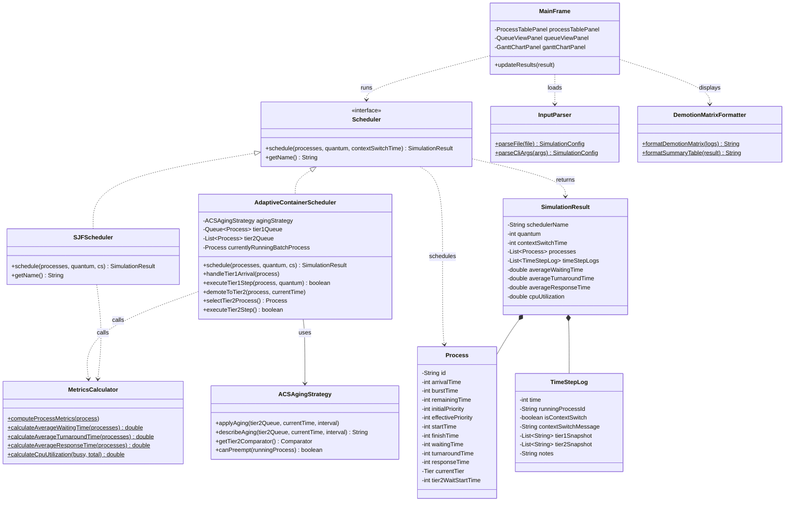

# Class Diagram

```mermaid
classDiagram
    class Scheduler {
        <<interface>>
        +schedule(processes, quantum, contextSwitchTime) SimulationResult
        +getName() String
    }

    class Process {
        -String id
        -int arrivalTime
        -int burstTime
        -int remainingTime
        -int initialPriority
        -int effectivePriority
        -int startTime
        -int finishTime
        -int waitingTime
        -int turnaroundTime
        -int responseTime
        -Tier currentTier
        -int tier2WaitStartTime
    }

    class TimeStepLog {
        -int time
        -String runningProcessId
        -boolean isContextSwitch
        -String contextSwitchMessage
        -List~String~ tier1Snapshot
        -List~String~ tier2Snapshot
        -String notes
    }

    class SimulationResult {
        -String schedulerName
        -int quantum
        -int contextSwitchTime
        -List~Process~ processes
        -List~TimeStepLog~ timeStepLogs
        -double averageWaitingTime
        -double averageTurnaroundTime
        -double averageResponseTime
        -double cpuUtilization
    }

    class SJFScheduler {
        +schedule(processes, quantum, cs) SimulationResult
        +getName() String
    }

    class AdaptiveContainerScheduler {
        -ACSAgingStrategy agingStrategy
        -Queue~Process~ tier1Queue
        -List~Process~ tier2Queue
        -Process currentlyRunningBatchProcess
        +schedule(processes, quantum, cs) SimulationResult
        +handleTier1Arrival(process)
        +executeTier1Step(process, quantum) boolean
        +demoteToTier2(process, currentTime)
        +selectTier2Process() Process
        +executeTier2Step() boolean
    }

    class ACSAgingStrategy {
        +applyAging(tier2Queue, currentTime, interval)
        +describeAging(tier2Queue, currentTime, interval) String
        +getTier2Comparator() Comparator
        +canPreempt(runningProcess) boolean
    }

    class MetricsCalculator {
        +computeProcessMetrics(process)$
        +calculateAverageWaitingTime(processes)$ double
        +calculateAverageTurnaroundTime(processes)$ double
        +calculateAverageResponseTime(processes)$ double
        +calculateCpuUtilization(busy, total)$ double
    }

    class InputParser {
        +parseFile(file)$ SimulationConfig
        +parseCliArgs(args)$ SimulationConfig
    }

    class DemotionMatrixFormatter {
        +formatDemotionMatrix(logs)$ String
        +formatSummaryTable(result)$ String
    }

    class MainFrame {
        -ProcessTablePanel processTablePanel
        -QueueViewPanel queueViewPanel
        -GanttChartPanel ganttChartPanel
        +updateResults(result)
    }

    Scheduler <|.. SJFScheduler
    Scheduler <|.. AdaptiveContainerScheduler
    AdaptiveContainerScheduler --> ACSAgingStrategy : uses
    AdaptiveContainerScheduler ..> MetricsCalculator : calls
    SJFScheduler ..> MetricsCalculator : calls
    Scheduler ..> Process : schedules
    Scheduler ..> SimulationResult : returns
    SimulationResult *-- Process
    SimulationResult *-- TimeStepLog
    MainFrame ..> Scheduler : runs
    MainFrame ..> InputParser : loads
    MainFrame ..> DemotionMatrixFormatter : displays
```
