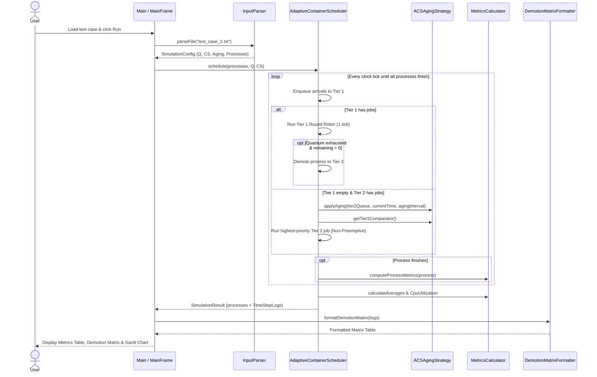

# Sequence Diagram (Running an ACS Simulation)

```mermaid
sequenceDiagram
    actor User
    participant UI as Main / MainFrame
    participant Parser as InputParser
    participant ACS as AdaptiveContainerScheduler
    participant Aging as ACSAgingStrategy
    participant Metrics as MetricsCalculator
    participant Fmt as DemotionMatrixFormatter

    User->>UI: Load test case & click Run
    UI->>Parser: parseFile("test_case_2.txt")
    Parser-->>UI: SimulationConfig (Q, CS, Aging, Processes)
    UI->>ACS: schedule(processes, Q, CS)

    loop Every clock tick until all processes finish
        ACS->>ACS: Enqueue arrivals to Tier 1
        alt Tier 1 has jobs
            ACS->>ACS: Run Tier 1 Round Robin (1 tick)
            opt Quantum exhausted & remaining > 0
                ACS->>ACS: Demote process to Tier 2
            end
        else Tier 1 empty & Tier 2 has jobs
            ACS->>Aging: applyAging(tier2Queue, currentTime, agingInterval)
            ACS->>Aging: getTier2Comparator()
            ACS->>ACS: Run highest-priority Tier 2 job (Non-Preemptive)
        end
        opt Process finishes
            ACS->>Metrics: computeProcessMetrics(process)
        end
    end

    ACS->>Metrics: calculateAverages & CpuUtilization
    ACS-->>UI: SimulationResult (processes + TimeStepLogs)
    UI->>Fmt: formatDemotionMatrix(logs)
    Fmt-->>UI: Formatted Matrix Table
    UI-->>User: Display Metrics Table, Demotion Matrix & Gantt Chart
```
