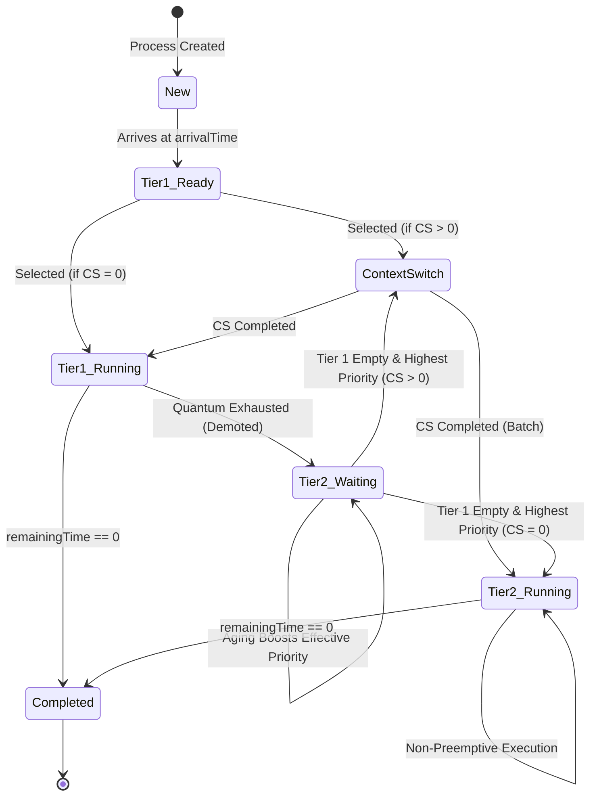

# State Diagram (Process Lifecycle in ACS)

```mermaid
stateDiagram-v2
    [*] --> New : Process Created
    New --> Tier1_Ready : Arrives at arrivalTime
    Tier1_Ready --> ContextSwitch : Selected (if CS > 0)
    Tier1_Ready --> Tier1_Running : Selected (if CS = 0)
    ContextSwitch --> Tier1_Running : CS Completed
    ContextSwitch --> Tier2_Running : CS Completed (Batch)

    Tier1_Running --> Completed : remainingTime == 0
    Tier1_Running --> Tier2_Waiting : Quantum Exhausted (Demoted)

    Tier2_Waiting --> Tier2_Waiting : Aging Boosts Effective Priority
    Tier2_Waiting --> ContextSwitch : Tier 1 Empty & Highest Priority (CS > 0)
    Tier2_Waiting --> Tier2_Running : Tier 1 Empty & Highest Priority (CS = 0)

    Tier2_Running --> Tier2_Running : Non-Preemptive Execution
    Tier2_Running --> Completed : remainingTime == 0
    Completed --> [*]
```
