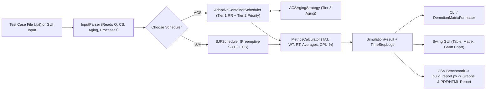

# System Workflow Diagram

```mermaid
flowchart LR
    A["Test Case File (.txt) or GUI Input"] --> B["InputParser (Reads Q, CS, Aging, Processes)"]
    B --> C{"Choose Scheduler"}
    C -->|SJF| D["SJFScheduler (Preemptive SRTF + CS)"]
    C -->|ACS| E["AdaptiveContainerScheduler (Tier 1 RR + Tier 2 Priority)"]
    E <--> F["ACSAgingStrategy (Tier 3 Aging)"]
    D --> G["MetricsCalculator (TAT, WT, RT, Averages, CPU %)"]
    E --> G
    G --> H["SimulationResult + TimeStepLogs"]
    H --> I["CLI / DemotionMatrixFormatter"]
    H --> J["Swing GUI (Table, Matrix, Gantt Chart)"]
    H --> K["CSV Benchmark -> build_report.py -> Graphs & PDF/HTML Report"]
```
