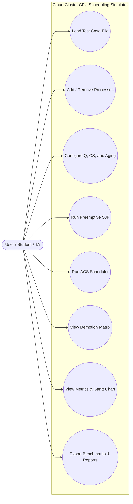

# Use Case Diagram

```mermaid
flowchart LR
    User(["User / Student / TA"])

    subgraph System["Cloud-Cluster CPU Scheduling Simulator"]
        UC1(("Load Test Case File"))
        UC2(("Add / Remove Processes"))
        UC3(("Configure Q, CS, and Aging"))
        UC4(("Run Preemptive SJF"))
        UC5(("Run ACS Scheduler"))
        UC6(("View Demotion Matrix"))
        UC7(("View Metrics & Gantt Chart"))
        UC8(("Export Benchmarks & Reports"))
    end

    User --> UC1
    User --> UC2
    User --> UC3
    User --> UC4
    User --> UC5
    User --> UC6
    User --> UC7
    User --> UC8
```
